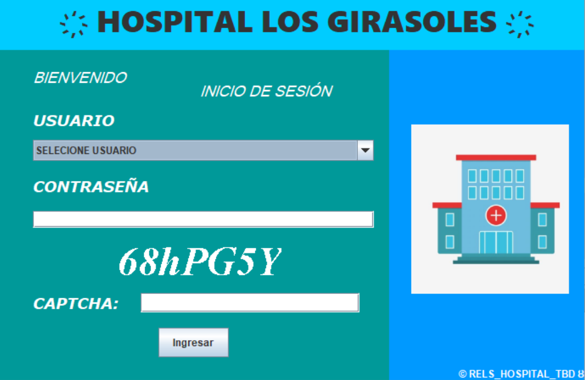
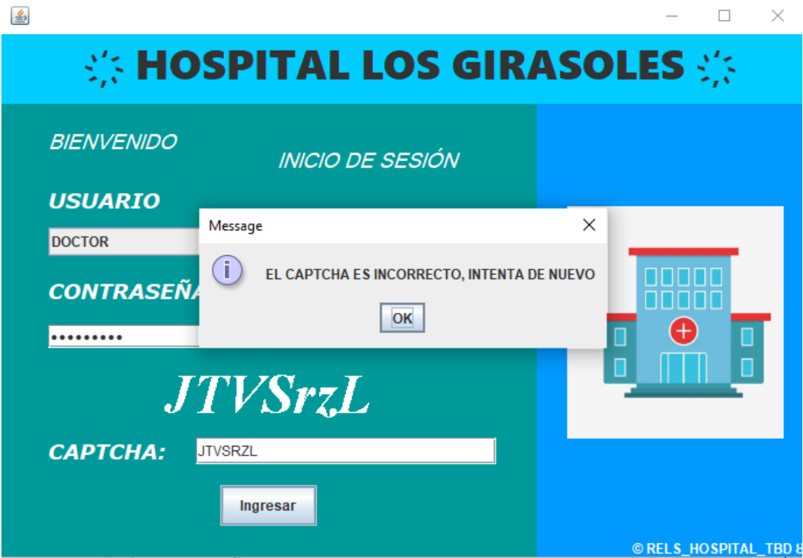
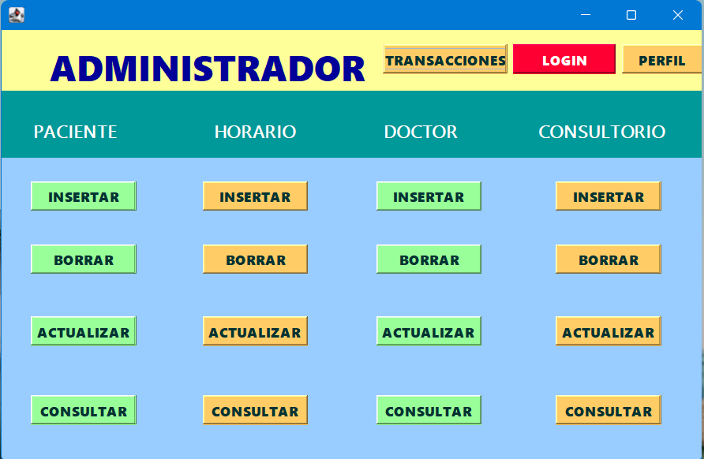
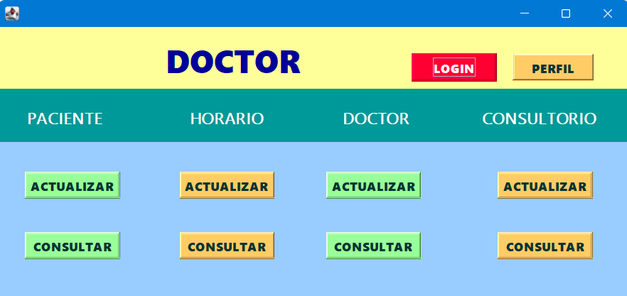
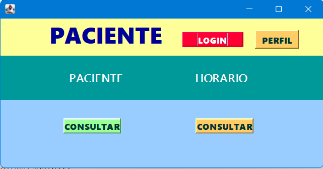
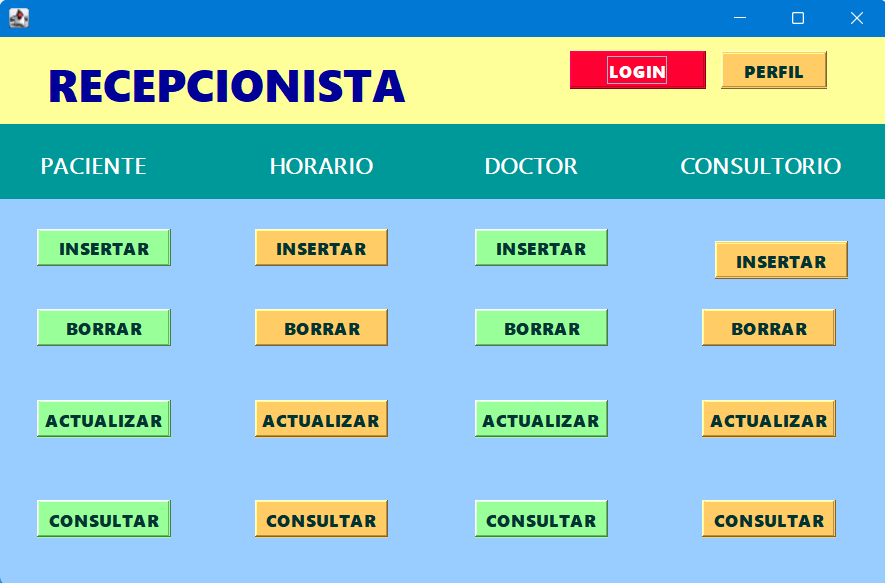
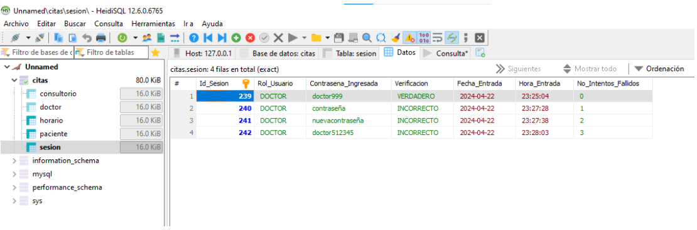

# 🏥 Hospital Los Girasoles — Sistema de Gestión Hospitalaria

> Aplicación desktop desarrollada en Java con autenticación por roles,
> CAPTCHA generado desde cero, auditoría de accesos y CRUD completo
> para gestión hospitalaria.

---

## 🛠️ Tecnologías

| Capa | Tecnología |
|------|-----------|
| Lenguaje | Java (JDK 8+) |
| Interfaz | Java Swing |
| Base de Datos | MariaDB / MySQL |
| Conexión BD | JDBC con PreparedStatement |
| Seguridad | CAPTCHA propio · Bloqueo por intentos · Auditoría |
| IDE | NetBeans |

---

## 🏗️ Arquitectura

- **59 clases Java** organizadas en paquetes por responsabilidad
- **4 roles de usuario**: Recepcionista, Paciente, Doctor, Administrador
- **Pantallas diferenciadas** por rol con acceso controlado a módulos
- **CRUD completo** sobre 5 entidades: paciente, doctor,
  consultorio, horario, sesión

---

## 🔐 Módulo de Seguridad

### CAPTCHA generado desde cero
- Generación aleatoria de texto alfanumérico de 7 caracteres
- Renderizado como imagen con `Graphics2D` y `BufferedImage`
- Validación en login contra el valor en memoria
- Bloqueo automático tras 3 intentos fallidos

### Auditoría de accesos
- Cada intento de login se registra en la tabla `sesion`
- Campos: rol, verificación, fecha, hora, intentos fallidos

### Protección SQL
- `PreparedStatement` en las 49 clases con operaciones de BD
- Protección contra SQL Injection en todas las operaciones

---

## 🗄️ Base de Datos

### 📌 Nombre: `citas`

- **paciente**
  - Nombre_Paciente
  - Apellido_Paterno_Paciente
  - Apellido_Materno_Paciente
  - CURP
  - Telefono
  - Hora_Entrada
  - Hora_Salida

- **doctor**
  - Nombre_Doctor
  - Apellido_Paterno_Doctor
  - Apellido_Materno_Doctor
  - Id_Doctor
  - Especialidad

- **consultorio**
  - Id_Doctor
  - Id_Consultorio

- **horario**
  - Cita_Horario
  - CURP
  - Id_Doctor

- **sesion**
  - Id_Sesion
  - Rol_Usuario
  - Contrasena_Ingresada
  - Verificacion
  - Fecha_Entrada
  - Hora_Entrada
  - No_Intentos_Fallidos

- **usuarios**
  - Identificador
  - Rol
  - Nombre
  - Apellidos
  - Direccion
  - Telefono
  - Correo
  - RutaFoto

---

## ⚙️ Cómo ejecutar

1. Clona el repositorio:
```bash
git clone https://github.com/rafael-romero-dev/hospital-java-swing.git
```
2. Instala MariaDB y crea la base de datos ejecutando el script:
```bash
mysql -u root -p < citas_hospital.sql
```
3. En `Clases/Conectar.java` configura tu contraseña de MariaDB
4. Crea la carpeta `captcha/` en la raíz del proyecto
5. Abre el proyecto en NetBeans y ejecuta `Principal/Inicio.java`

---

## 📁 Capturas de Pantalla

| Vista | Descripción |
|-------|-------------|
|  | Login con CAPTCHA |
|  | Verificación de funcionamiento de Captcha |
|  | Perfil del administrador con sus funcionalidades y accesos |
|  | Perfil del doctor con sus funcionalidades y accesos |
|  | Perfil del paciente con sus funcionalidades y accesos |
|  | Perfil del recepcionista con sus funcionalidades y accesos |
|  | Auditoría en BD |

---

## 👤 Autor

**Rafael Romero Negrete**
Ingeniero en Sistemas Computacionales — Instituto Tecnológico de Cuautla

- LinkedIn: [linkedin.com/in/rafael-romero2110](https://linkedin.com/in/rafael-romero2110)
- GitHub: [github.com/rafael-romero-dev](https://github.com/rafael-romero-dev)